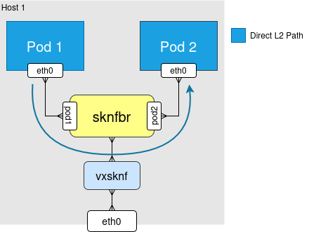
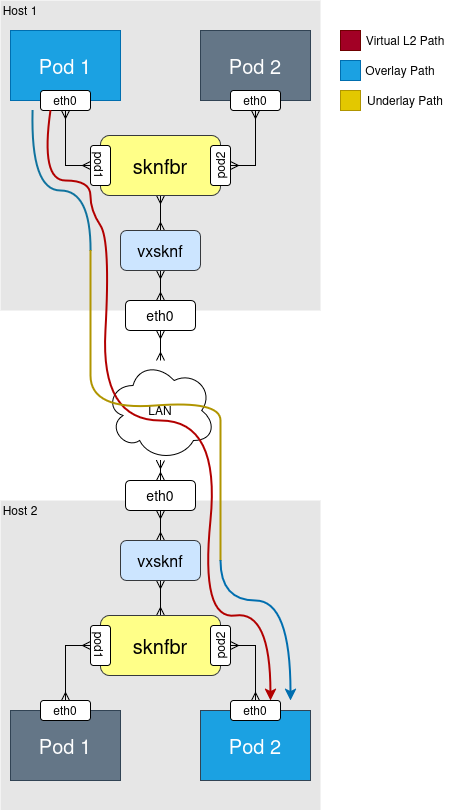
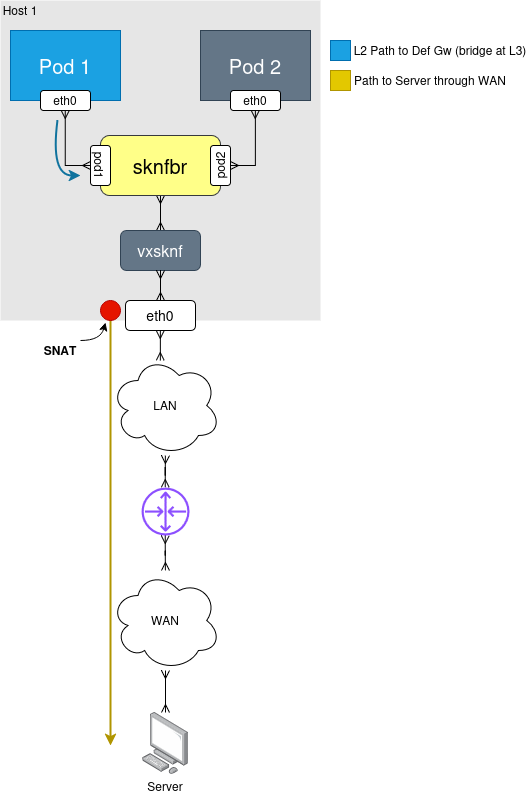
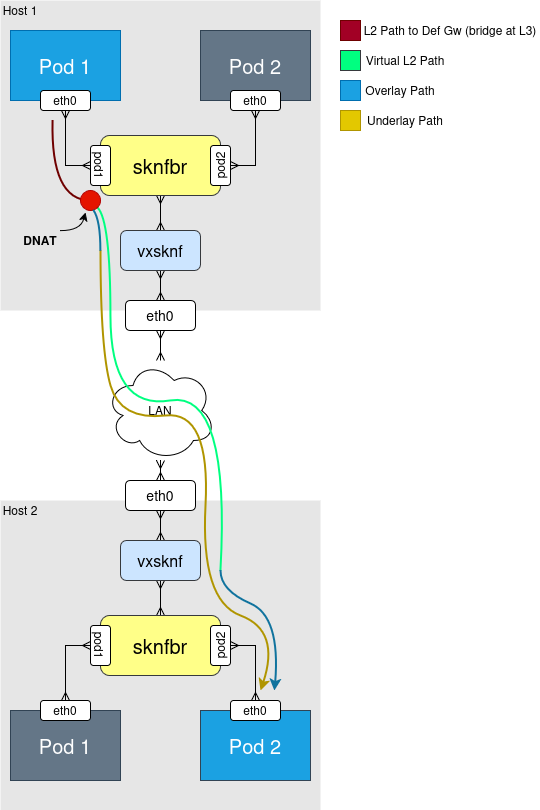

# sknf

A **simple Kubernetes network fabric** implementation.

**sknf** acts as the network manager of Kubernetes clusters, supporting:

* Intra-node pod-to-pod communication;
* Inter-node pod-to-pod communication;
* Pod-to-Internet communication;
* Pod-to-pod communication through Kubernetes Services.

> NOTE: **sknf** is not production ready nor meant to be used in "serious" projects.

## Installing

To install **sknf** as the network manager of a Kubernetes cluster:

1. Build the Docker image via `make`.
2. Push the built **sknf** image to a container registry of your choice.
3. Open `sknf-app/k8s/daemonset.yaml` and:
   * set `image` to the image you pushed;
   * set `CLUSTER_CIDR` to your cluster’s pod CIDR;
   * set `HOST_PHYSICAL_IF` to the name of the physical network interface on your cluster nodes.
4. Deploy **sknf** with:
   ```bash
   kubectl apply -f ./sknf-app/k8s/rbac.yaml -f ./sknf-app/k8s/daemonset.yaml
   ```

## How does it work?

**sknf** employs a minimal design to make Kubernetes networking work.

Interface-wise:

* A virtual bridge (**brsknf**) is created on each host;
* A veth pair is created for each pod: one end inside the pod netns (**eth0**) and the peer on the host attached to the bridge (**sknf<hash>**);
* A VXLAN interface is created on each host, attached to the bridge (**vxsknf**) and bound to the host’s physical interface (as configured);

Routing-wise:

* Each pod interface (**eth0**) is configured with an IP from the cluster pod CIDR and a netmask that covers the full cluster-wide CIDR, so all cluster pods share a single virtual L2 domain;
* An IP address is assigned to the bridge **brsknf** so it is reachable at L3;
* The bridge **brsknf** is configured as the default gateway for all pods;
* An iptables postrouting rule is installed to ensure SNAT is performed on packets leaving the cluster.

Example flows:

### Intra-node pod-to-pod communication



* Pure L2 flow;
* Frames are switched through the bridge;
* The destination is considered on-link, so no L3 routing is performed.

### Inter-node pod-to-pod communication



* End-to-end L2 flow over a single virtual L2 domain (overlay);
* From the pods’ point of view, the destination is always on-link;
* In reality, VXLAN emulates this virtual L2 domain;
* It does so by encapsulating L2 frames into L3 packets between VTEPs (underlay), typically using IP multicast or unicast to reach remote nodes.

### Internet communication



* The pod determines the destination is not reachable via L2 and sends packets to its default gateway;
* The host bridge, which has an L3 address, acts as the default gateway;
* The packet is processed by the host’s L3 stack and forwarded to the external network;
* SNAT is applied on egress so that replies are routable back into the cluster;
* The host’s physical interface IP is used as the source IP of the outgoing packet.

### Inter-node pod-to-pod via ClusterIP (kube-proxy)



* In this scenario, the pod always considers the destination unreachable via L2, since the destination IP is a ClusterIP managed by kube-proxy (not part of the pod CIDRs);
* The pod therefore sends packets to its default gateway;
* The packet is handled by the host’s L3 stack and DNATed by kube-proxy’s iptables rules;
* After DNAT, the packet is forwarded over the overlay, with VXLAN handling the underlay encapsulation and decapsulation.
